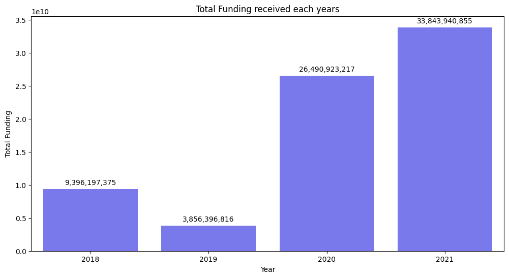
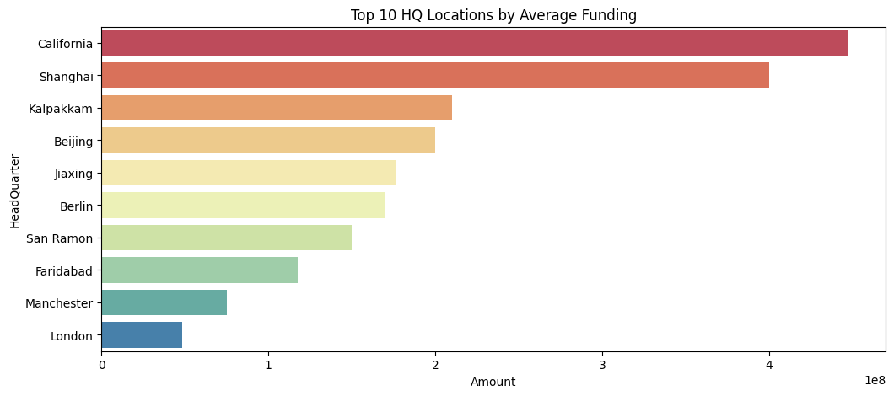
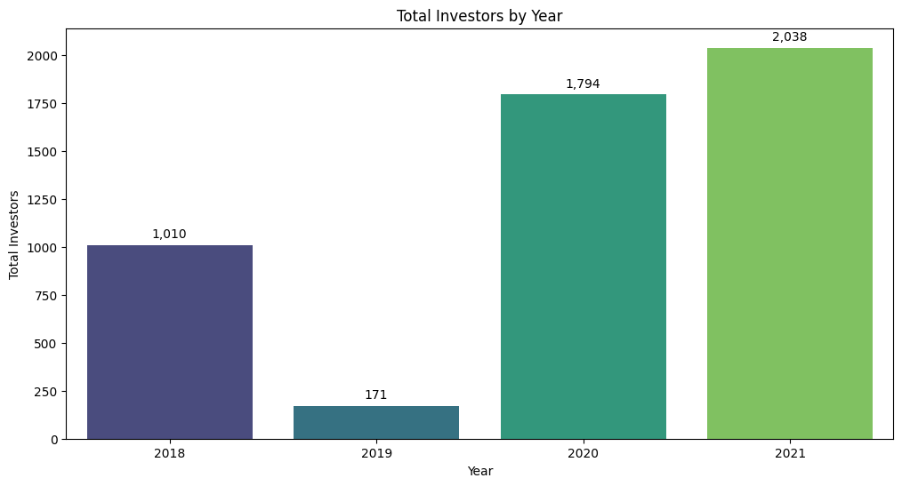
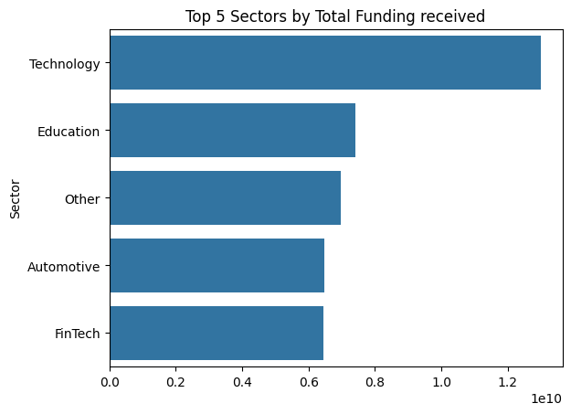
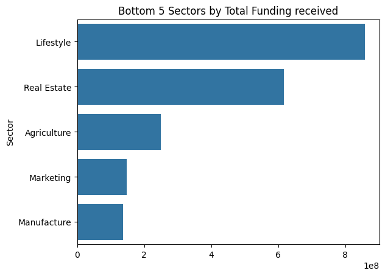
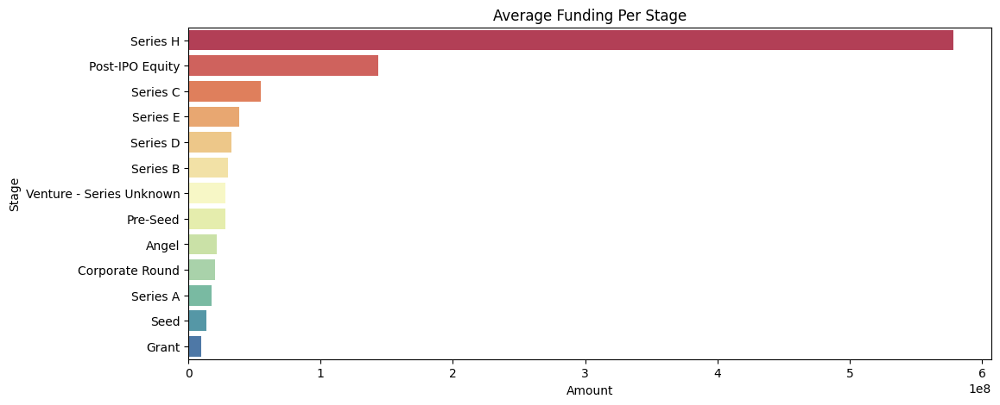

# Indian-Start-up-Ecosystem-Project

## Table of content
- [Project Overview](#project-overview)
- [Data Sources](#data-sources)
- [Data Cleaning and Preparation](#data-cleaning-and-preparation)
- [Data Analysis](#data-analysis)
- [Key Insights and Recommendations](#key-insights-and-recommendations)
- [Conclusion](#conclusion)
- [How to Run the Project](#how-to-run-the-project)
- [Contact Information](#contact-information)


## Project Overview

My team is looking to venture into the Indian start-up ecosystem and so I, as a data expert has been tasked with investigating this start-up ecosystem in India, to recommend the best course of action for the team. My research is going to focus on the details of funding for these start-ups in India, where I will dive deep into a data containing all the details about fundings received by the start-ups and communicate my findings and recommendations to the team in the best way possible.

I will be leveraging the widely used CRISP-DM Framework for this project.

The CRISP-DM (Cross-Industry Standard Process for Data Mining) framework is a widely used methodology for data mining and data analysis projects. It provides a structured approach for planning and executing data projects. The process is cyclic and iterative, consisting of six phases:

1. Business Understanding
2. Data Understanding
3. Data Preparation
4. Modeling
5. Evaluation
6. Deployment

Though in this project, steps 4 and 5 won't be implemented

## Data Sources

For this project, I had to gather data from different sources. The data for 2018 is hosted in a github repository [here](https://github.com/Azubi-Africa/Career_Accelerator_LP1-Data_Analysis/blob/main/startup_funding2018.csv)

The data for 2019 was hosted on OneDrive, which I downloaded to my local stotage and uploaded to my github repo to be read in to pandas from there. Data for 2020 and 2021 were hosted on an SQL Server database that was accessed using the right credentials like username, database name, password and server.

below are the common fields/columns for 2019, 2020 and 2021 and their descriptions

| Field           | Description                                                     |
|-----------------|-----------------------------------------------------------------|
| Company_Brand   | Name of start-up company                                        |
| Founded         | Year it was founded                                             |
| HeadQuarter     | Headquarters or location of the company                         |
| Sector          | Sector of the company                                           |
| What_it_does    | A brief description of what the company does                    |
| Founders        | Name(s) of the founder(s) of the company                        |
| Investor        | Name(s) of the investor(s) of the company                       |
| Amount          | Amount invested into the company by investor(s)                 |
| Stage           | Current stage of the startup (e.g. Pre-seed, Pre-series, Series A, Series D) |


2018 had different column names but most had the same meaning as the columns for 2019, 2020 and 2021

| Field           | Description                                                     |
|-----------------|-----------------------------------------------------------------|
| Company Name    | Name of start-up company                                        |
| Industry        | Sector of the company                                           |
| Round/Series    | Current stage of the startup                                    |
| Amount          | Amount invested into the company by investor(s)                 |
| Location        | Headquarters or location of the company                         |
| About Company   | A brief description of what the company does                    |

At the end the concatenation and feature engineering, these were the current columns

| Field           | Description                                                     |
|-----------------|-----------------------------------------------------------------|
| Company_Brand   | Name of start-up company                                        |
| Founded         | Year it was founded                                             |
| HeadQuarter     | Headquarters or location of the company                         |
| Sector          | Sector of the company                                           |
| What_it_does    | A brief description of what the company does                    |
| Currency        | Currency from the 'Amount' column                               |
| Investor        | Name(s) of the investor(s) of the company                       |
| Amount          | Amount invested into the company by investor(s)                 |
| Stage           | Current stage of the startup (e.g. Pre-seed, Pre-series, Series A, Series D) |
| Num_of_Investors| Number of investor(s) of the startup company                    |
| Num_of_Founders | Number of founders of the startup company                       |
| new_amount      | cleaned version of the 'Amount' column                          |


## Data Cleaning and Preparation

Before the data cleaning process begins, differing column names in all the 4 datasets were replaced with the right names to make concatenation successful. Then a 'Year' column was added to each of the dataset to help when running a yearly analysis on the data. After concatenation, the data contained 2879 rows and 11 columns.

The data had a lot of missing values in the columns which will later be imputed with the right central tendency value and also duplicates which were dropped during the data cleaning process.

The cleaning process was done by tackling one column before the next column and some of the issues solved during the process were;

- #### Problems with the 'HeadQuarter' column

  - Incorrect city names(wrong spellings) and invalid values
    I went ahead to replace all the incorrect spellings and invaliid with the original to ensure uniformity. I replaced all invalid values with no meaning as 'NaN' to be identified as null values that I would later impute.

  - Having the country attached to it (Trivandrum, Kerala, India)
    I wrote a function that checks if the rows is a string object and if there's a comma(,) in it, and then splits the row by the comma and picks the first value, else if in case there's a float in there replace it with a null value, else if all these conditions are not satisfied, it probably the kind of value we want in the column, therefore return it.

    ```python
    def pick_first(x):
      if (isinstance(x, str)) and (',' in x):
        return x.split(',')[0]
      elif isinstance(x, float):
        return np.nan
      else:
        return x 
    ```
    
    
  - Missing values

    This column had 116 missing values, that is a lot to be imputing with just one most occuring value (mode). So I wrote a function that create a list of the 10 most occuring values in that column and randomly picks one to fill in for a missing value in the column.

    ```python
    from collections import Counter
    import random

    def most_occuring_and_fill(column):
        # Convert the column to a list for processing
        x = column.tolist()
    
        # Count the frequency of each element in the list (ignoring None values)
        counter = Counter([item for item in x if pd.notna(item)])
    
        # Get the 10 most common elements
        most_common = counter.most_common(10)
    
        # Extract the elements (ignoring their counts)
        most_common_elements = [item for item, count in most_common]
        # Create a new list where missing values are filled
        filled_list = [
            item if pd.notna(item) else random.choice(most_common_elements) 
            for item in x
        ]
    
        return filled_list
    ```


- #### Problems with the 'Sector' column

  - Dash entries ('-')

    Some entries were symbols, therefore I wrote a general symbol format to check all those entries and fill them with 'Not Sepecified'.

  - Double Sectors

    I created a new column called 'new_sector' and assigned it a value 'other'. I created a list of subcategories and then with the help of masking, I then checked the 'sector' column if any row contained a value in any of the subcategories so it can fill in with the appropriate sector in the 'new_sector' column.
    I then go ahead to drop the 'sector' column and rename the 'new_sector' column to the 'sector' column.

  - missing values

    Missing values as a result of entries being symbols were filled with 'Not Specified' before going ahead to create a new column.

  ```python
  # Define your lists of substrings
   tech = ['Mobile','Technology', 'Internet', 'Software', 'Hardware','SaaS','Blockchain','Apps','Information Services','SEM',
        'Artificial Intelligence','CleanTech','Aerospace','Robotics','Ai','PaaS','Medtech','Agritech','HR tech',
       'Tech','FoodTech','Safety tech','IoT','Legal tech','Infratech','Netwokring platform','Telecommunication','Cloud','Aero',
       'Virtual','Content','Photonics','app','Proptech','Deeptech','AR','VR','Agri tech','-Tech','AgriTech','IT','Network',
        'Data','HrTech','Foodtech','Spacetech','E-mobility','Automation','Logitech','HRTech','Drone','MLOps','Innovation',
       'BioTechnology','TaaS','network','equipment','SpaceTech','CRM','MarTech','Nanotechnology','Femtech','startup','AI']
  fin = ['Lending','Finance','Insurance', 'Payments','Financial Services','Credit','Credit Cards','Mutual Funds',
       'Banking','Escrow','Venture','financial','Taxation','Capital','firm','Equity']
  fint = ['NFT','Virtual Banking','FinTech','Fintech','Cryptocurrency','Crypto','Insurtech','InsurTech']
  health = ['Health', 'Medical','Pharmaceutical','Health Diagnotics','Health Care','Hospital','Biotechnology','Biopharma',
         'Hygiene management','HealthTech','Healthcare','HealthCare','laboratory','Biotech','Healthtech','HeathTech',
         'Helathcare','Veterinary']
  mkt = ['Brand Marketing','Marketing','Event Promotion','Market']
  agric = ['Farming','Agriculture','Nutrition','Hauz Khas','Fishery']
  con = ['Food','Food and Beverages','Dairy','Beverages','Beer','FMCG']
  econ = ['B2B','Shopping','E-Commerce','Trading Platform','E-commerce','E-marketplace','marketplace','e-commerce','Ecommerce',
        'E-market','Commerce','Trading platform']
  cons = ['Wholesale','Consumer','Shoes','Packaging','Retail','Consulting','Food Delivery']
  edu = ['E-Learning','EdTech','Education','Communities','Edtech','Preschool','School']
  welln = ['Lifestyle','Beauty','Wellness','Cosmetics','Yoga','Skincare','D2C','Fitness','Lifestyle','Training']
  real_est = ['Real Estate','Home Decor','Accomodation','Interior design','Home Design','Home interior','Co-living',
          'Construction']
  log = ['Logistics','Rental','Tourism','Travel','TravelTech','Transport','Transportation','Aviation','Mobility']
  auto = ['Automotive','Electric vehicle','Industrial Automation','Vehicles','Automotive tech','Automobile','Tyre','car','Car',
       'Vehicle','Mechanical']
  manu = ['Manufacturing']
  ener = ['Renewable Energy','Solar','Energy','Energy Storage','Battery','Oil and Gas','Renewable','EV','Electricity',
       'purification','Renewables']
  medi = ['Entertainment','Media','News','Video','Digital Media','FM','Publication','OTT','Social Network','Music',
        'Digital platform','Podcast','publishing','Blogging']
  game = ['Gaming','Games','Sports']
  style = ['Fashion','Jewelry','Eyeglasses','Eye Wear','Apparel','Dating','Celebrity','Eyewear','D2C Fashion','Matrimony',
         'Textiles','D2C jewellery','Foootwear','Arts']
  hos = ['Hospitality','Hotel','Leisure']


  # Define the general pattern for symbols
    symbols_pattern = r'[^a-zA-Z0-9\s]'
    df['Sector'] = df['Sector'].replace(symbols_pattern, 'Not Specified')

  df['new_sector'] = 'Other'
  df.loc[df['Sector'].str.contains('|'.join(tech)), 'new_sector'] = 'Technology'
  df.loc[df['Sector'].str.contains('|'.join(fin)), 'new_sector'] = 'Finance'
  df.loc[df['Sector'].str.contains('|'.join(health)), 'new_sector'] = 'Healthcare'
  df.loc[df['Sector'].str.contains('|'.join(mkt)), 'new_sector'] = 'Marketing'
  df.loc[df['Sector'].str.contains('|'.join(agric)), 'new_sector'] = 'Agriculture'
  df.loc[df['Sector'].str.contains('|'.join(econ)), 'new_sector'] = 'E-Commerce'
  df.loc[df['Sector'].str.contains('|'.join(edu)), 'new_sector'] = 'Education'
  df.loc[df['Sector'].str.contains('|'.join(welln)), 'new_sector'] = 'Wellness/Beauty'
  df.loc[df['Sector'].str.contains('|'.join(real_est)), 'new_sector'] = 'Real Estate'
  df.loc[df['Sector'].str.contains('|'.join(log)), 'new_sector'] = 'Logistics'

  df.loc[df['Sector'].str.contains('|'.join(auto)), 'new_sector'] = 'Automotive'
  df.loc[df['Sector'].str.contains('|'.join(manu)), 'new_sector'] = 'Manufacture'
  df.loc[df['Sector'].str.contains('|'.join(ener)), 'new_sector'] = 'Energy'
  df.loc[df['Sector'].str.contains('|'.join(medi)), 'new_sector'] = 'Media/Entertainment'
  df.loc[df['Sector'].str.contains('|'.join(hos)), 'new_sector'] = 'Hospitality'
  df.loc[df['Sector'].str.contains('|'.join(style)), 'new_sector'] = 'Lifestyle'
  df.loc[df['Sector'].str.contains('|'.join(cons)), 'new_sector'] = 'Consumer Services'
  df.loc[df['Sector'].str.contains('|'.join(game)), 'new_sector'] = 'Gaming'
  df.loc[df['Sector'].str.contains('|'.join(fint)), 'new_sector'] = 'FinTech'
  df.loc[df['Sector'].str.contains('|'.join(con)), 'new_sector'] = 'Consumables'

   ```
  Though I advise to rather go by regular functions.
    

- #### Problems with the 'Amount' column

  - mixed up data types

  converted everythong to a string object before I started working on it. This is because I will be leveraging a lot of string methods to clean things up.

  - currency mix-up and values with no currency

    To be able to impute the values in this columnIn the amount column,first a lot of values had the dollar currency attached to them while some were raw figures without currencies and others had the Rupee sign. So I created a new column called 'currency' which gets it's values from the 'Amount' column depending on the currency attached. If any value had didn't have a currency, just return 'Not Specified' in the currency column.

    ```python
    # first convert every value in the 'Amount' column to string so string function can be run on it
     df['Amount'] = df['Amount'].apply(lambda x: str(x))

     # Write a function that determines currency
     def determine_currency(value):
         if ('$' in value) or (value.isdigit()) :
             return 'Dollars'
         elif '₹' in value:
             return 'Rupees'
         else:
             return 'Not Specified'

     # Add new column 'Currency' by applying the function to 'Amount'
     df['Currency'] = [determine_currency(value) for value in df['Amount']]
    ```

    Now this 'currency' column is going to help me understand the 'Amount' column. Before concatenating all the four datasets, the 'Amount' column was previously named as 'Amount($)' in 3 different datasets, giving a hint that values in the that column are supposed to be in dollars, also I run a value_counts() on the 'currency' column and realised that 1446 rows were in dollars, 1266 were not specified and 144 rows were in Rupees. I then went ahead and decided to use the average dollar exchange rate from 2018 to 2021 to convert the values in Rupees to dollars.

    ```python
    # The below function takes in an argument 'amt'

    def clean_amount(amt):
       if (pd.isnull(amt)) or (amt in ['—', 'Seed', '$', 'Undisclosed', 'undisclosed']):
           return np.nan
       elif isinstance(amt, str):
           if '$' in amt:
               # Remove any non-numeric characters and return the numeric part
               return ''.join(filter(str.isdigit, amt))
           elif '₹' in amt:
               # Convert to dollars with the appropriate exchange rate
               return str(round(float(amt.replace('₹', '').replace(',', '')) / 68.41, 2))
       try:
           # Convert the value to a float and back to string then to string
           return str(float(amt))
       except ValueError:
           return np.nan
    ```

      I went ahead to create a new column 'new_amount' by applying the above function to the 'amount' column.

  - invalid entries(Seed, $, Undisclosed)

    Replaced them with missing values in the function.

  - Incorrect values
    
    Before I imputed missing values, I realized the column had unrealistic values that didn't conform to the normal investment amounts (values as high as $150bn and some as low as $4,000) in the startup world. I got rid of these values (they were about 30) by filtering them out through masking and dropping them.

    ```python
    filtered_df = df.loc[(df['new_amount'] > 17000000000) | (df['new_amount'] < 80000)]

    # drop them from the dataframe
    df = df.drop(filtered_df.index)
    ```

  - missing values
    
    There were 563 missing values which I imputed with the average amounts for the 4 different years.

    ```python
    # function to impute the missing values with mean amounts of their respective years
    def fill_with_year_mean(df, year_col='Year', amount_col='new_amount'):
        # Group by year and calculate the mean amount
    year_mean = df.groupby(year_col)[amount_col].mean()

    # Iterate through rows
    for index, row in df.iterrows():
        if pd.isnull(row[amount_col]):
            year = row[year_col]
            if year in year_mean.index:
                df.at[index, amount_col] = year_mean[year]

    return df[amount_col]


    df['new_amount'] = fill_with_year_mean(df)
    ```


- #### Problems with the 'Stage' Column

  - Invalid stages and url links as entries

  I listed the valid stage names in a list called 'valid_stages' and then I checked through the 'stages' column to see which rows didn't contain any of the values in the 'valid_stages' column and then assigned those values as missing.

    ```python
       # list of valid development stages of start-ups
       valid_stages = ['Venture - Series Unknown','Seed', 'Angel', 'Series A', 'Series B', 'Pre-Seed', 'Grant', 'Series H', 
                'Series A', 'Series C', 'Series E', 'Corporate Round','Series D','Debt financing','Post-IPO Equity']

      # if the value in 'Stage' is not one of the values in the valid_stages list, return null value for that row
      df.loc[~df['Stage'].isin(valid_stages), 'Stage'] = np.nan

  ```


  - missing values

  There were I510 missing values which I went on to fill with the help of the function I wrote earlier to fill the missing values randomly with the 10 most occuring values in that column.

  ```python
     # fill in randomly from the list of 10 most occuring values
    df['Stage'] = most_occuring_and_fill(df['Stage'])
  ```

- #### Problems with the 'Num_of_Investors' and 'Num_of_Founders'

  - missing values

  For these two columns I imputed the missing values with the middle values (median)

- #### Exploratory Data Analysis

I checked for the summary statistics of the numerical columns, visualized their distributions to identify trends and then I looked at the count of values in some of categorical columns.

## Data Analysis

In this section I will first test my three hypothesis which were;

- Hypothesis 1: Startups headquartered in major metropolitan areas of India likely to receive higher funding amounts than other areas. 
- Hypothesis 2: Startups with multiple investors are likely to receive higher amounts of funding.
- Hypothesis 3: Funding amounts vary across sectors.

I then go ahead to answer my business questions;

1. what is the overall trend in funding amounts over the specified time period? 
   - Total and average funding amounts over the years?

2. Which year had the most investors?

3. Which startups received the highest funding amount for each year?
   - Which sectors are those companies from?
   - What does these companies do?

4. What are the top 5 and bottom 5 start-ups according to total investment amount and Which sectors are they from?

5. What are the top 5 and bottom 5 sectors by Total Funding amount received?

6. Top 10 HQ locations by average funding amounts.
   
7. What is the number of funding deals per HQ locations?

8. What is the average amount of funds received by startups at different stages?

9. What is the number of deals per stage?

10. What is the average number of founders per startup?
    - Show a distribution plot of the number of founders.

## Key Insights and Recommendations

- ### Hypothesis Testing

  - Despite initial assumptions, funding disparities between metropolitan and other areas were not statistically significant. This suggests that startups outside major metros might have competitive access to funding, highlighting opportunities for regional startups.

  - The weak correlation between the number of investors and funding amount indicates that simply increasing investor count does not substantially boost funding. Startups should focus on attracting high-value investors and demonstrating strong growth potential.

  - Sector-wise funding analysis reveals no significant variation, indicating a balanced investment approach across sectors. This suggests a diversified investment strategy among investors, reducing sector-specific risks

- ### Yearly Funding Trends

- 2021's record $34bn funding likely reflects a post-pandemic rebound and increased investor confidence. Startups should leverage this momentum by showcasing resilience and adaptability.




- ### HeadQuarter insights

  - California tops the list of HQ locations by average funding, with	$447M, Though Bangalore is the HQ location with the highest number of deals, amassing 931 deals in that timeframe, followed by Mumbai with 467 deals. California's high average funding highlights the importance of strategic HQ locations. Startups might consider establishing operations in innovation hubs to attract more substantial investments. 




- ### Investor Activity

  - The surge of 2,038 investors in 2021 emphasizes the growing interest in the Indian startup ecosystem. Startups should enhance investor relations and leverage networking opportunities to secure funding.




- ### Noteworthy Startups:

  - A startup called Swiggy got the highest funding in 2018. They received $1bn from an anonymous investor. Swiggy is a food ordering and delivery company that provides food service solutions for restaurants.

  - A startup that provides room for comfortable stay, called Oyo, received a total fund of $693M in 2019 from 3 investors namely MyPreferred Transformation, Avendus Finance and SoftBankwhich. This amount was the highest for that year.

  - Snowflake, which is a startup in the Technology sector that received the highest funding in 2020, a total fund of $3bn from Salesforce Ventures and Dragoneer Investment Group. Snowflake is a cloud data platform that provides a data warehouse-as-a-service designed for the cloud.

  - VerSe Innovation is a Technology startup that received the highest funding in 2021. They received a total fund of $1bn from 3 investors namely Canaan Valley Capital and Glade Brook Capital Partners.

- ### Sector Analysis

  - Technology's dominance with $13bn investment aligns with global tech trends, with emerging trends such as advancements in AI, cloud computing, or fintech innovations within the tech industry might have driven such investments. Startups in other sectors should highlight tech integration to attract similar attention.




  - Manufacturing's lower investment suggests potential growth opportunities. Policymakers and investors might focus on bolstering this sector to drive balanced economic growth.




- ### Stage-wise Funding

  - Looking at the average fund per stage, Series H tops the list even though only 4 startups from Series H stage were funded while the Seed stage tops the list of the number of startups funded, 731. The high average funding at the Series H stage is reflective of the reduced risk, increased maturity, and higher valuation of the startups, combined with favorable market conditions and strategic interest from investors. This might be the reasons investors are advised to invest huge funds into in Series H stage startups.

  - Average funding at the seed stage being the second lowest is typical, due to the early-stage nature of startups, higher associated risks, and the focus on initial development and validation. As startups prove their business models and achieve significant milestones, they attract larger investments in subsequent funding rounds. Within the 4-year timeframe, the seed stage companies got many fundings but their average was very low, but outliers like Snowflake (received a $3bn investment) indicate potential for high-risk, high-reward investments. Early-stage startups should focus on robust business models and proof of concept to attract significant seed funding.




## Conclusion

This analysis provides valuable insights into the Indian start-up ecosystem, highlighting key trends and areas for potential investment.

## How to Run the Project

Clone this repository.

Install the required Python libraries.

Run the `main.ipynb` notebook to reproduce the analysis.


## Contact Information

For any questions or suggestions, please contact:

email : [my email](richmondyeboah299@gmail.com)

GitHub : [richmond-yeboah](https://github.com/richmond-yeboah)

Phone : +233541059520 or +233503677485


